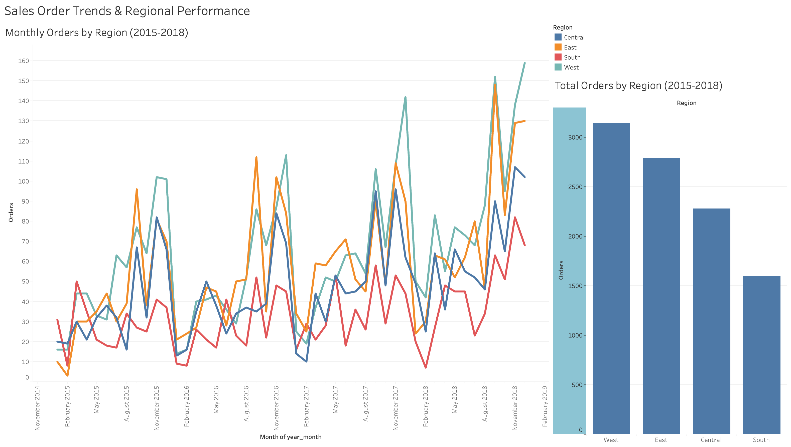

# Sales & Order Trend Analysis

## Overview
This project analyzes multi-year sales order data to identify monthly trends, seasonality, and regional performance patterns.  
The analysis was conducted using SQL for data preparation, Python for validation and analysis, and Tableau for visualization.

## Dataset
- ~9,800 transactional sales records
- Fields include order date, region, product details, and sales amount
- Dates were inconsistently formatted (dd/mm/yyyy vs mm/dd/yyyy) and required normalization

## Tools & Technologies
- SQL (data cleaning, aggregation)
- Python 3.x (pandas, matplotlib)
- Tableau (dashboarding & visualization)

## Key Analysis Steps
1. Normalized inconsistent date formats in SQL to enable accurate time-series analysis
2. Aggregated orders by month and region to identify trends and seasonality
3. Recreated and validated SQL analysis in Python using pandas
4. Built Tableau dashboards to visualize monthly and regional order patterns

## Key Insights
- Order volume increases year-over-year with strong seasonal peaks from September through December
- The West and East regions consistently lead in order volume across all periods
- The South region lags behind others and exhibits weaker seasonal lift, suggesting potential growth opportunities

## Visualizations
### Monthly Orders by Region

## Files
- `analysis.ipynb` — Python analysis and visualizations
- `queries.sql` — SQL queries used for data cleaning and aggregation
- `orders_by_month_region.csv` — Aggregated dataset used in Tableau

## Next Steps
- Extend analysis to CRM / sales pipeline data
- Rebuild dashboards in Power BI for comparison
